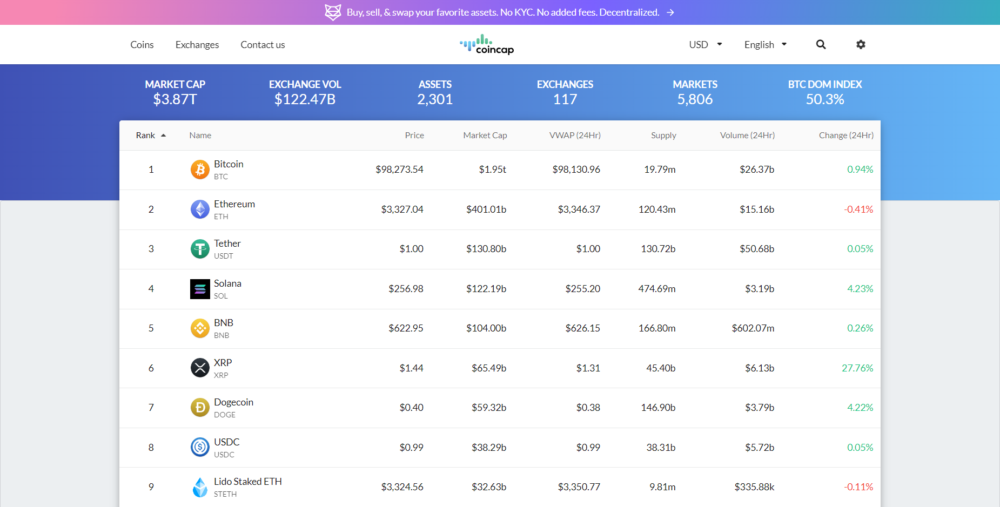

# APIRESTful

Bem-vindo à documentação oficial do projeto **APIRESTful**! Este projeto é uma API desenvolvida com **FastAPI** para gerenciar autenticação de usuários, consumir dados de uma API externa e realizar operações básicas com um banco de dados **PostgreSQL**. Feito por Raul Rangel Moraes Bezerra.

---

## CoinCap

Minha API faz uso de um endpoint da API da [CoinCap](https://coincap.io), que fornece informações sobre o mercado de criptomoedas em tempo real. Esse serviço é utilizado para consultar dados sobre ativos digitais, como o valor atual de várias moedas. Através dessa integração, os usuários podem obter informações atualizadas sobre as dez criptomoedas com maior Market Cap através da minha aplicação.

---

## Como Rodar

[Clique aqui](setup.md) para saber como rodar a aplicação localmente.

---

## Endpoints

[Clique aqui](endpoints.md) para ver os Endpoints disponíveis na minha API.

## Vídeo de Funcionamento

<video controls width="800">
  <source src="img/Execucao.mp4" type="video/mp4">
  Seu navegador não suporta vídeos embutidos.
</video>

## AWS

[Clique aqui](aws.md) para ver o deploy na AWS.